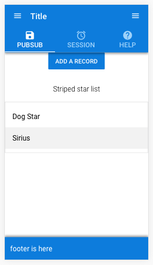

## Jan-Pro Customer Incident Reporting and Tracking

### Tech
 - Quasar 0.15.10
 - Meteor 1.6.1
 - Coffeescript
 - Pug
 - Stylus
 - Vue
 - Material Design
 - MongoDB


#### Boilerplate Readme
Meteor -> Vue -> Quasar (Coffeescript, pug, stylus)

Forked from **https://github.com/Akryum/meteor-vue2-example-routing**
with added Quasar.
 

#### Installation

**clone this repository:**

```
git clone https://github.com/quasarframework/quasar-template-meteor.git
```

**cd into the 'template' folder:**
```
cd quasar-template-meteor/template
```

**Install from npm**

```
meteor npm install
```
**Then here we transpile two es6 .js files (one for ios, one for material design) to commonjs which meteor needs**

Do not remove .babelrc.RENAMED. It is necessary for the transpile script.

```
npm run transpile
```
**N.B. Windows users** - you should use transpile.bat instead of the above command.
Reference: https://github.com/quasarframework/quasar-template-meteor/issues/18

**run meteor (inside template folder)**

```
meteor
```

———————

It should eventually say:
App running at: http://localhost:3000/

Then if you open Chrome or Firefox dev tools and click on the mobile phone icon you should see this:


This project uses the Akryum projects to get Meteor working with vuejs and quasar-framework.
The most useful page to consult is:
https://github.com/meteor-vue/vue-meteor-tracker

Main page for all the Meteor/Vuejs projects:
https://github.com/meteor-vue/vue-meteor


#### Note:
The 'template' folder is necessary for the *quasar cli* command to function.
All meteor commands however should only be run once you are inside the 'template' folder.
This extra 'template' folder is there because quasar-framework requires it. Quasar-framework uses Webpack for its builds, but Meteor does not.
This means that it is unlikely that you will be able to use *quasar cli*, for example, because it all leads up to a quasar build using webpack.

To use Meteor, cd into the 'template' folder and run meteor commands from there.
